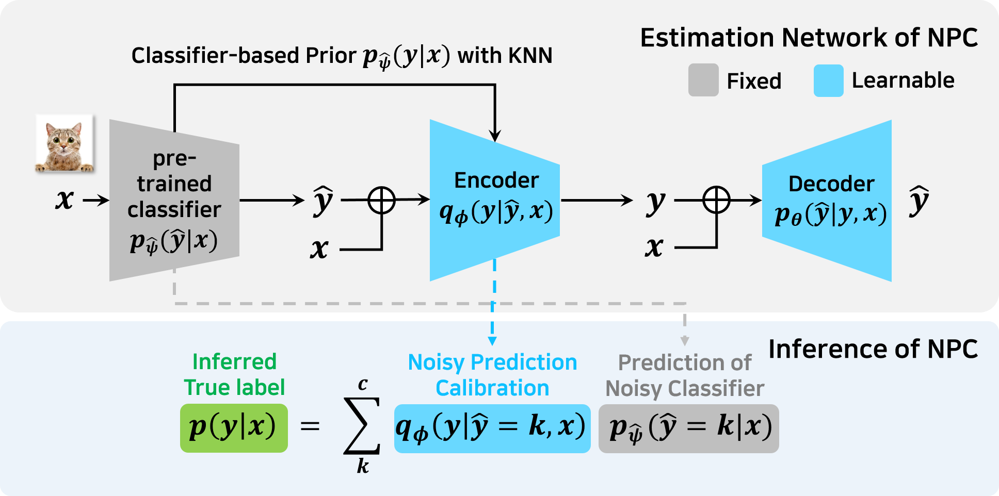

# NPC (Noisy Prediction Calibration via Generative Model, ICML 2022)

Official PyTorch implementation of
[**"From Noisy Prediction to True Label: Noisy Prediction Calibration via Generative Model"**](https://arxiv.org/abs/2205.00690) (ICML 2022) by
[HeeSun Bae*](https://sites.google.com/view/baeheesun),
[Seungjae Shin*](https://sites.google.com/view/seungjae-shin),
[Byeonghu Na](https://wp03052.github.io/),
[JoonHo Jang](https://scholar.google.com/citations?user=oYbKry4AAAAJ&hl=ko&oi=ao),
[Kyungwoo Song](https://mlai.uos.ac.kr/),
and [Il-Chul Moon](https://aailab.kaist.ac.kr/xe2/members_professor/6749).

## Overview

Our method, NPC, calibrates the prediction from a imperfectly pre-trained classifier to a true label via utilizing a deep generative model.  
NPC operates as a post-processing module to a black-box classifier, without further access into classifier parameters.

<p align="center">
  
</p>

## Setup

Install required libraries.

We kindly suggest other researchers to run this code on `python >= 3.6` version.
```
pip install -r requirements.txt
```
Pretrained models are available at [dropbox](https://www.dropbox.com/sh/a1rhu01lvehscs0/AABIqn-cdKNiKfLqY4G8zxqEa?dl=0).

## Train models

### Step 0. Noisy Data Generation

Generate synthetic noisy dataset.
```
python generate_noisy_data.py
```
We also provide pre-processed dataset at [dropbox](https://www.dropbox.com/sh/a1rhu01lvehscs0/AABIqn-cdKNiKfLqY4G8zxqEa?dl=0).

### Step 1. Train classifier model 

Train the classifier model. 
```
python train_classifier.py --dataset MNIST -- noise_type sym --noisy_ratio 0.2 --class_method no_stop --seed 0 --data_dir {your_data_directory}
```
It will train the base classifier with `CE` (Cross Entropy) loss on the `MNIST` dataset with `sym` (symmetric 20%) noise. 

We also provide other noise types:
* `clean` : no noise
* `sym` : symmetric
* `asym` : asymmetric
* `idnx` : instance-dependent
* `idn` : Similarity related instance-dependent

Please refer the code for the notation of each pre-training method. (e.g. `vanilla` for early-stopping). 
For the provided codes for baseline models, some were taken from the author's code, others reproduced directly. Because of this, there may be slight differences from the reported performance of each method.

Generated dataset should be located in `your_data_directory`.

To save your time, We also provide the checkpoints of pre-trained classifiers at [dropbox](https://www.dropbox.com/sh/a1rhu01lvehscs0/AABIqn-cdKNiKfLqY4G8zxqEa?dl=0).

### Step 2. Compute KNN Prior
Compute prior information from pre-trained classifier model.
```
python main_prior.py --dataset MNIST --noise_type sym --noisy_ratio 0.2 --class_method no_stop --seed 0 --data_dir {your_data_directory}
```
It will compute the prior information from the base classifier with `CE` (Cross Entropy) loss on the `MNIST` dataset with `sym` (symmetric 20%) noise. 

### Step 3. Train NPC
Train NPC to calibrate the prediction of pre-trained classifier.

```
python main_npc.py --dataset MNIST --noise_type sym --noisy_ratio 0.2 --class_method no_stop --post_method npc --knn_mode onehot --prior_norm 5 --data_dir {your_data_directory}
```
It will train NPC from the KNN prior and the corresponding base classifier with `CE` (Cross Entropy) loss on the `MNIST` dataset with `sym` (symmetric 20%) noise. 


